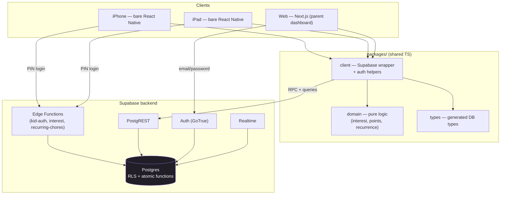
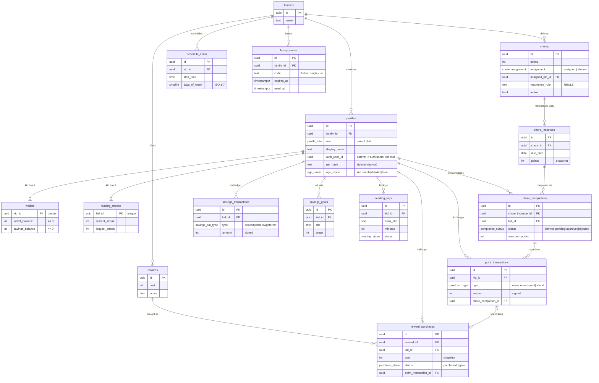
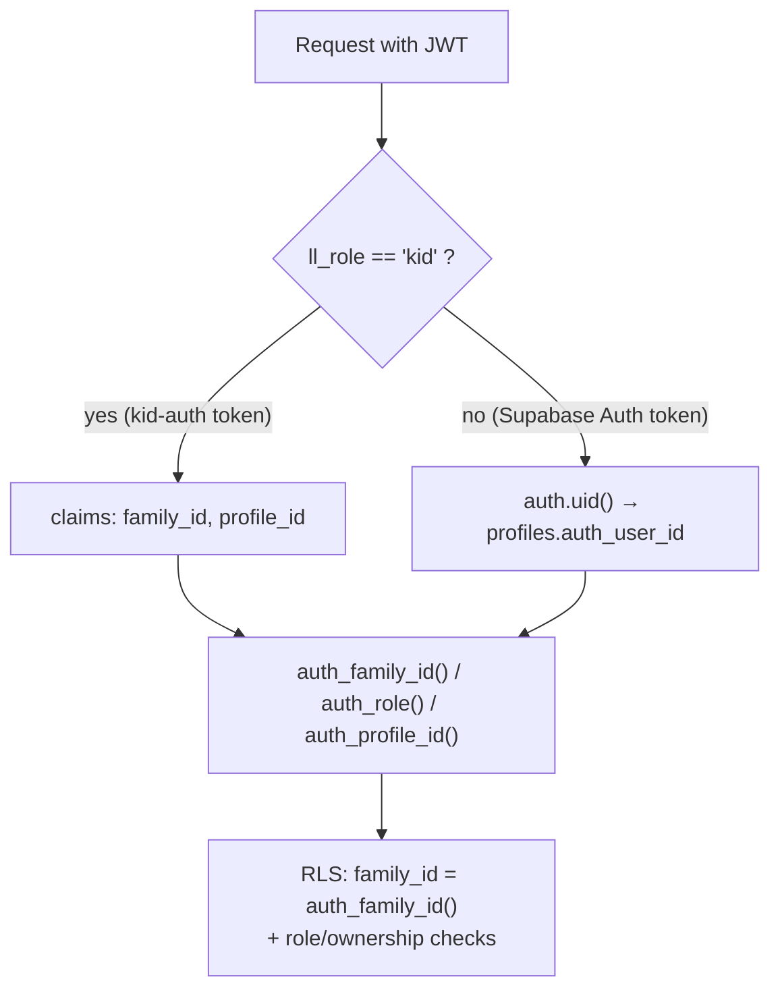
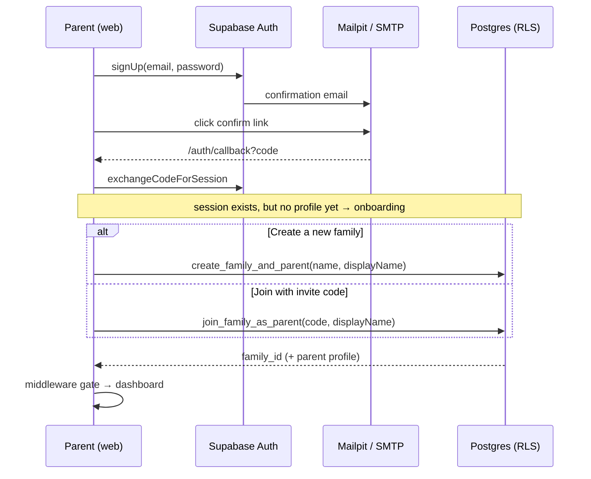
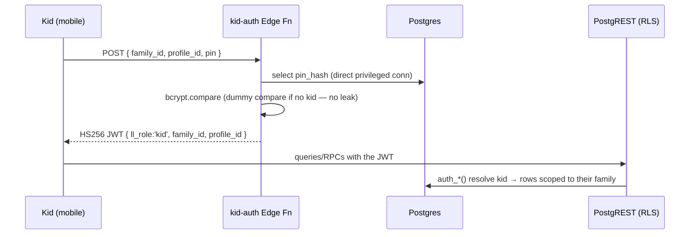
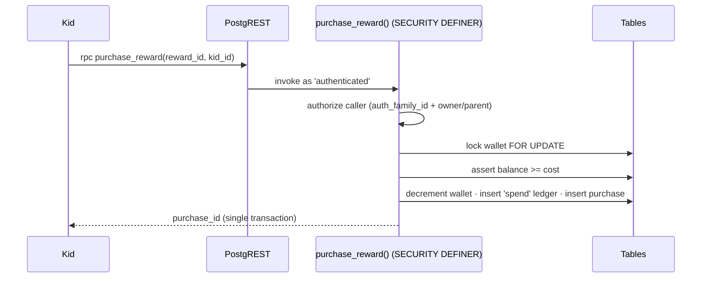
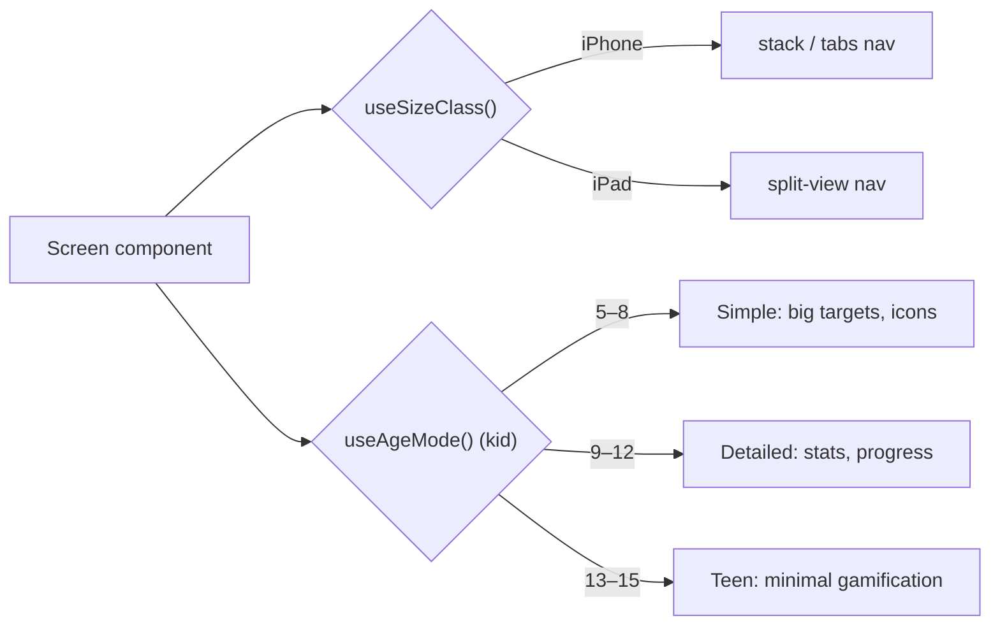
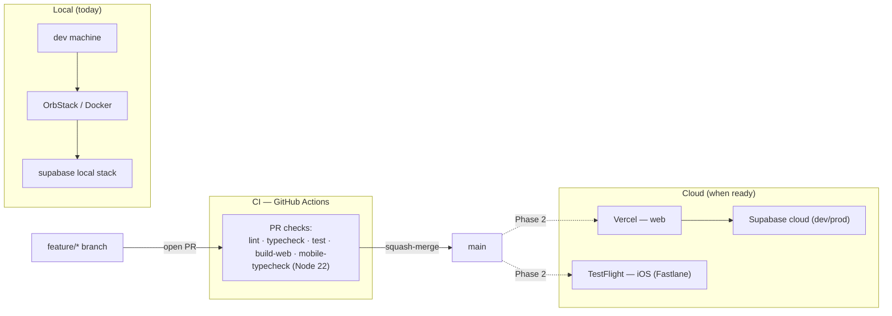

# LootLoop — Architecture

LootLoop is a family chore & reward app. Two roles — **parent** (manages chores, rewards, approvals) and **kid** (completes chores, earns/spends points, reads, saves). This document describes the system as built; diagrams are [Mermaid](https://mermaid.js.org/) so they render on GitHub and stay version-controlled.

> Source of truth for the task breakdown and conventions: [`lootloop-technical-plan.md`](./lootloop-technical-plan.md). Session history: [`docs/session-notes/`](./docs/session-notes/).

---

## 1. System overview

A pnpm monorepo with two client apps and shared packages, backed by Supabase (Postgres + RLS + Auth + Edge Functions + Realtime). **Family isolation is enforced in the database via Row-Level Security — never in app code.** All money/state mutations run through atomic SQL functions, never client-side writes.



**Platform matrix (v1):** parent on iPhone/iPad/Web; kid on iPhone/iPad only (kid-on-web deferred). Web is the primary management surface.

---

## 2. Repository layout

```
lootloop/
├── apps/
│   ├── mobile/        bare React Native (iOS Universal; Android stub for Phase 2)
│   └── web/           Next.js App Router (parent dashboard; marketing in Phase 2)
├── packages/
│   ├── domain/        pure TS: interest, points, recurrence (heavily unit-tested)
│   ├── client/        Supabase client wrapper + auth helpers (shared)
│   └── types/         Supabase-generated TS types
├── supabase/
│   ├── migrations/    001_initial_schema → 004_auth_bootstrap
│   ├── functions/     kid-auth (+ interest, recurring-chores to come)
│   └── tests/         RLS + atomic-function + bootstrap SQL tests
├── design/            tokens, ui_kits, components, specs/
└── docs/              architecture + session notes
```

**Stack constraints (deliberate):** bare RN only (no Expo/EAS), pnpm only (no npm/yarn), trunk-based git (`main` + short-lived `feature/*` → squash-merge PRs). CocoaPods is in use today; SPM migration is a Phase 2 item.

---

## 3. Data model

15 family-scoped tables. **`families` is the isolation root** — every table carries a `family_id` that RLS keys on. Money/points are integers (never floats); balances are read-only to clients and move only through atomic functions. Ledgers (`point_transactions`, `savings_transactions`) are append-only.



_Audit/provenance FKs (`reviewed_by`, `awarded_by`, `given_by`, `created_by`, `used_by` → `profiles`) are omitted from the diagram for clarity; all are `ON DELETE SET NULL` to preserve history. `family_id` is `ON DELETE CASCADE` everywhere._

**Enums:** `profile_role`, `age_mode`, `chore_assignment`, `completion_status`, `reading_status`, `purchase_status`, `point_txn_type`, `savings_txn_type`.

---

## 4. Security model

Two layers: **RLS** decides which rows a principal can read/select, and **atomic `SECURITY DEFINER` functions** perform every privileged mutation while authorizing the caller in-body.

### 4.1 Principal resolution

There are two kinds of authenticated principal, resolved to `(family_id, role, profile_id)` by helper functions so every policy is written once:



- **Parents** are real `auth.users`; their JWT carries no custom claims.
- **Kids** are _not_ auth users — the `kid-auth` Edge Function mints a JWT with `ll_role='kid'`, `family_id`, `profile_id` (contract documented in `002_rls_policies.sql`).
- Read-only tables (`wallets`, the two ledgers, `reading_streaks`) have **no** client write privilege at all — so even a policy bug can't let a client write a balance.

### 4.2 Atomic functions (the only writers of money/state)

`SECURITY DEFINER`, pinned `search_path`, `FOR UPDATE` row locks, idempotent where relevant — and each **authorizes the caller** via the `auth_*()` helpers, because the client calls RPC directly (there is no trusted server in between):

| Function                   | Who may call                 | Guarantees                               |
| -------------------------- | ---------------------------- | ---------------------------------------- |
| `award_points_on_approval` | parent in family             | idempotent; no double-award              |
| `purchase_reward`          | owning kid or parent         | balance check; no overdraft/double-spend |
| `transfer_to_savings`      | owning kid or parent         | no overdraft either direction            |
| `credit_interest`          | `service_role` only (cron)   | atomic savings credit                    |
| `create_family_and_parent` | confirmed user w/ no profile | bootstrap; blocks re-bind                |
| `create_family_invite`     | parent                       | single-use, 7-day code                   |
| `join_family_as_parent`    | confirmed user w/ no profile | invite redemption (locked)               |

> **Convention:** any new RLS-bypassing function MUST self-authorize the caller and ship adversarial tests. See `supabase/tests/`.

---

## 5. Key flows

### 5.1 Parent signup → onboarding



Route gating (Next.js middleware, `@supabase/ssr` cookie sessions): **no session → `/login`**, **session but no parent profile → `/onboarding`**, **onboarded → dashboard**.

### 5.2 Kid PIN login



### 5.3 Atomic operation (reward purchase)



---

## 6. Adaptive UI

Mobile is **adaptive, not separate apps**: one component tree branches at runtime.



State via Zustand; styling via NativeWind (mobile) / Tailwind (web). The service-layer boundary is `packages/client` — screens never touch the Supabase client directly or bypass RLS.

---

## 7. Deployment & environments



| Env        | Supabase                  | Web            | Mobile             |
| ---------- | ------------------------- | -------------- | ------------------ |
| Local      | Docker (`supabase start`) | localhost:3000 | iOS sim / device   |
| Preview    | cloud (dev)               | Vercel preview | Fastlane `ios dev` |
| Production | cloud (prod)              | Vercel prod    | TestFlight         |

**Secrets discipline:** `.env` at repo root (server/shared), `apps/web/.env.local` (`NEXT_PUBLIC_*` only — safe in the client bundle), `apps/mobile/.env` (via `react-native-config`). **`SUPABASE_SERVICE_ROLE_KEY` and the JWT secret are never bundled into client builds.** CI supplies public placeholders for the web build.

---

## 8. Testing layers

- **Unit (Jest):** `packages/domain` + app `stores`/`hooks` (70% target). Supabase calls are mocked at the service boundary — not unit-tested.
- **Integration (SQL against local Supabase):** RLS isolation (cross-family, parent + kid), atomic-function edge cases, auth bootstrap — `supabase/tests/*.sql`, deterministic/rolled-back.
- **E2E (planned):** Maestro for iOS (one flow runs on iPhone + iPad), Playwright for web — 4–6 golden paths.

---

## 9. Current status

Built & merged: monorepo + tooling + CI; full schema (15 tables); RLS + atomic functions; kid-auth Edge Function; parent-auth backend + web screens. Remaining for v1: mobile parent-auth screens, adaptive nav shells, the kid PIN screen, then the chore/points/rewards/reading/savings feature surfaces. See [`docs/session-notes/`](./docs/session-notes/) and the project task list.
