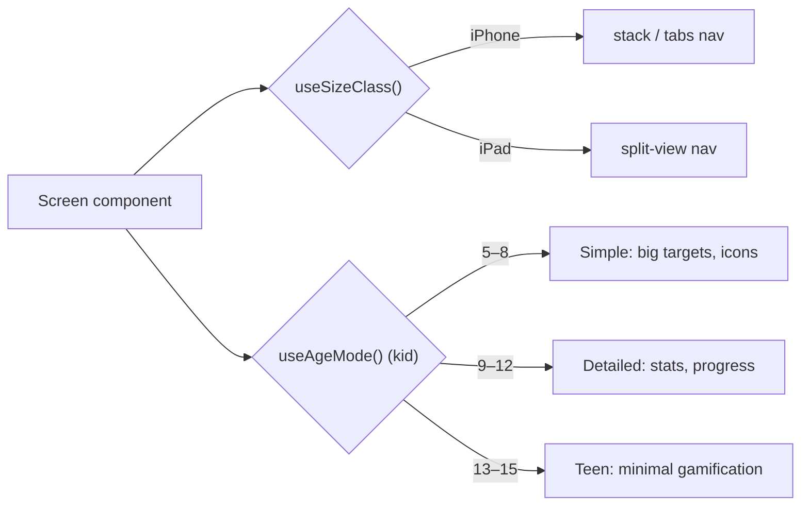

# Frontend — Mobile

`apps/mobile` is a bare React Native app (RN 0.86, React 19, no Expo) targeting iOS Universal (iPhone + iPad). Source lives under `apps/mobile/src/`. It is **adaptive, not separate apps**: one component tree branches at runtime on size class and (for kids) age mode.

## Navigation

Navigators live in `apps/mobile/src/navigation/`:

- `RootNavigator.tsx` — a single stable root stack under `NavigationContainer`. Auth state only swaps the active screen (React Navigation's recommended auth pattern). Screen by state: loading → Splash; recovery session → `AuthStack` at ResetPassword; no session → `AuthStack` at Login; session with no parent profile → `AuthStack` at Onboarding; signed-in parent → `ParentShell`; signed-in kid → `KidShell`.
- `AuthStack.tsx` — the login / onboarding / reset flow (see [Auth & Onboarding](../features/auth-onboarding.md)).
- `ParentShell.tsx` — adaptive parent nav: bottom tabs on compact (iPhone), sidebar + detail split-view on regular (iPad).
- `KidShell.tsx` — adaptive kid nav: bottom tabs on compact, split-view on regular, with a slim greeting + log-out top bar (shared family device).

Screens live in `apps/mobile/src/screens/` (parent: `chores/`, `approvals/`, `rewards/`, `schedule/`, `family/`; kid: `kid-dashboard/`, `kid-chores/`, `kid-store/`, `kid-reading/`, `kid-savings/`, `kid-login/`).

## State — Zustand

Session stores live in `apps/mobile/src/stores/`:

- `session.tsx` — the parent Supabase Auth session (status, `hasParentProfile`, recovery flag).
- `kidSession.tsx` — the kid session (kids are not `auth.users`; the store holds the minted kid JWT + profile).

Data access always goes through the [service layer](./service-layer.md) (`packages/client`) — screens and stores never import the Supabase client directly.

## Styling — twrnc

Styling is [twrnc](./stack-decisions.md), a pure-JS Tailwind runtime — **not NativeWind**. The shared instance is `apps/mobile/src/lib/tw.ts`:

```ts
import { create } from 'twrnc';
const tw = create(require('../../tailwind.config.js'));
export default tw;
```

Use `style={tw\`bg-orange p-4\`}`/`tw.style(...)`, never a `className`prop. Other`lib/`modules:`supabase.ts`(client factory) and`sentry.ts` (crash reporting — no-op without a DSN; sends zero PII for COPPA).

## Adaptive UI

Two hooks (`apps/mobile/src/hooks/`) drive the branching.

`useSizeClass()` returns `compact` below 768px (iPhone portrait) or `regular` at/above it (iPad), recomputed on rotation via `useWindowDimensions`. It picks the navigation shell:



`useAgeMode()` reads the signed-in kid's `profile.age_mode` and returns `simple` (5–8), `detailed` (9–12), or `teen` (13–15). It defaults to `detailed` when there is no kid session (e.g. parent surfaces), so any component can call it safely. Screens use it to select the right age-mode theme.

State via Zustand; styling via twrnc. The service-layer boundary is `packages/client` — screens never touch the Supabase client directly or bypass RLS.
