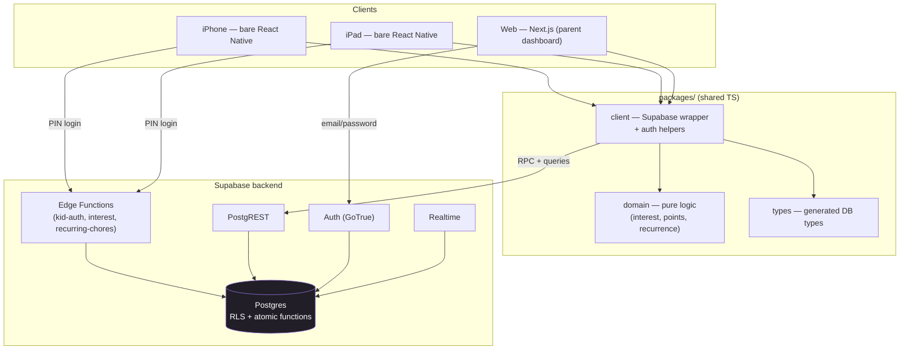

# System Architecture

LootLoop is a pnpm monorepo with two client apps and shared packages, backed by Supabase (Postgres + RLS + Auth + Edge Functions + Realtime).

## Structure

- **Two clients:** bare React Native (`apps/mobile`, iOS Universal) and Next.js App Router (`apps/web`, the primary parent management surface). See [Frontend — Mobile](./frontend-mobile.md) and [Frontend — Web](./frontend-web.md).
- **Shared packages:** `packages/client` (the [service layer](./service-layer.md) — the only code that talks to Supabase), `packages/domain` (pure logic), `packages/types` (generated [DB types](../backend/data-model.md)).
- **Backend:** Supabase — Postgres with RLS + atomic functions, Auth (GoTrue), PostgREST, Edge Functions, Realtime.

## Two core principles

1. **Family isolation is enforced in the database via Row-Level Security — never in app code.** Every family-scoped table carries a `family_id`; RLS policies key on the caller's resolved family so a client can only ever read/write its own family's rows. See [Security & RLS](../backend/security-rls.md).
2. **All money/state mutations run through atomic SQL functions**, never client-side writes. Balances and ledgers are read-only to clients; awarding points, purchasing rewards, and moving savings each run in a single `SECURITY DEFINER` transaction that also authorizes the caller. See [Atomic Functions](../backend/atomic-functions.md).

## Platform matrix (v1)

| Role   | iPhone | iPad | Web                              |
| ------ | ------ | ---- | -------------------------------- |
| Parent | yes    | yes  | yes (primary management surface) |
| Kid    | yes    | yes  | no (deferred)                    |
