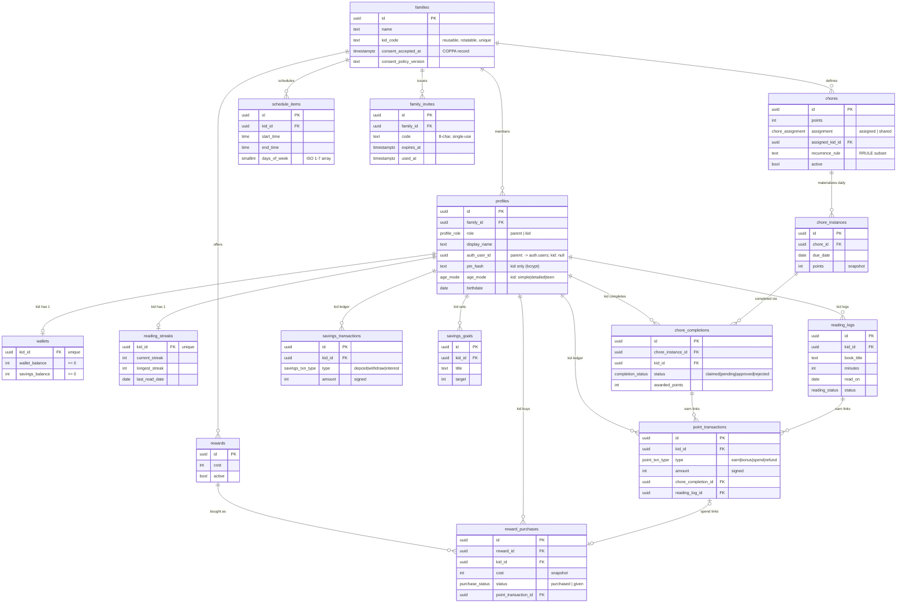

# Data Model

LootLoop's schema is **16 family-scoped tables** (`families` plus 15 tables that carry a `family_id`). **`families` is the isolation root** — every other table carries a `family_id` that [Row-Level Security](./security-rls.md) keys on. Money and points are `INTEGER` (never floats); balances are read-only to clients and move only through the [atomic SQL functions](./atomic-functions.md). The two ledgers (`point_transactions`, `savings_transactions`) are append-only.

Schema source: `supabase/migrations/001_initial_schema.sql` (base tables), `004_auth_bootstrap.sql` (`family_invites` + `families.consent_*` cols added in `011`), `005_kid_management.sql` (`families.kid_code`), `007_reading_approval.sql` (`point_transactions.reading_log_id`).

## Entity relationships

## Tables

### families

The isolation root. Holds `name` plus:

- `kid_code` — a reusable, parent-rotatable, unique 8-char code a kid device types to fetch the roster (added in `005`; auto-generated by a `BEFORE INSERT` trigger).
- `consent_accepted_at` / `consent_policy_version` — the COPPA verifiable-parental-consent artifact, stamped atomically at family creation (added in `011`).

### profiles

Every family member — **parent XOR kid**, discriminated by `role`. Two CHECK constraints enforce the shape:

- Parent: `auth_user_id` set (FK → `auth.users`), `pin_hash` / `age_mode` null.
- Kid: `pin_hash` (bcrypt) + `age_mode` set, `auth_user_id` null.

Key columns: `family_id`, `role`, `display_name`, `avatar_url`, `birthdate`.

### chores

Parent-authored template. Key columns: `title`, `icon`, `points`, `assignment` (`assigned` → `assigned_kid_id` required; `shared` → claimable, `assigned_kid_id` null), `recurrence_rule` (iCal RRULE subset, parsed by the generator not the DB), `active`.

### chore_instances

Materialized per-day occurrence of a chore — the unit a kid actually sees/completes. Key columns: `chore_id`, `due_date`, `points` (snapshot at generation time). Unique on `(chore_id, due_date)` — the idempotency key for the [recurring-chore generator](./edge-functions.md).

### chore_completions

Lifecycle `claimed → pending → approved | rejected`. Key columns: `chore_instance_id`, `kid_id`, `status`, `awarded_points` (snapshot set on approval), `reviewed_by`. Unique on `(chore_instance_id, kid_id)` — one completion per kid per instance.

### wallets

Current balances per kid — `wallet_balance` (spendable) and `savings_balance`, both `>= 0`. One row per kid (`kid_id` unique), bootstrapped by a trigger when a kid profile is inserted. **Read-only to clients**; mutated only by atomic functions.

### point_transactions

Append-only ledger for the spendable wallet. `type` ∈ `earn | bonus | spend | refund`; `amount` is signed (positive for earn/bonus/refund, negative for spend). Provenance FKs: `chore_completion_id`, `reading_log_id`, `awarded_by`. **Read-only to clients.**

### rewards

Parent-authored catalog item. Key columns: `title`, `emoji`, `image_url`, `cost`, `active`.

### reward_purchases

A kid bought a reward; fulfillment `purchased → given`. Key columns: `reward_id` (FK `ON DELETE RESTRICT`), `kid_id`, `cost` (snapshot), `status`, `point_transaction_id` (the spend row), `given_by`. Rows are created only by `purchase_reward()` (no client INSERT).

### reading_logs

A kid logs minutes + book title; approval awards points. Key columns: `book_title`, `minutes` (`> 0`), `read_on` (day it counts toward), `status` (`pending | approved | rejected`), `awarded_points`, `reviewed_by`.

### reading_streaks

One row per kid (`kid_id` unique). `current_streak`, `longest_streak`, `last_read_date`. **Read-only to clients**; advanced atomically inside `approve_reading_log()`.

### savings_transactions

Append-only ledger for the savings balance. `type` ∈ `deposit | withdraw | interest`; `amount` signed (positive into savings, negative out). **Read-only to clients.**

### savings_goals

A kid's named savings target. Key columns: `title`, `emoji`, `target` (`> 0`), `achieved_at`, `active`. Progress is derived from `wallets.savings_balance` at read time, not stored here.

### schedule_items

Time-based daily items per kid. Key columns: `title`, `icon`, `start_time`, `end_time`, `days_of_week` (ISO `1`=Mon..`7`=Sun `smallint[]`; empty = every day), `active`.

### family_invites

Single-use, 7-day co-parent invite codes (distinct from the reusable `families.kid_code`). Key columns: `code` (unique, 6–32 chars), `created_by`, `expires_at`, `used_at`, `used_by`. Rows are created only by `create_family_invite()` (no client INSERT).

## Enums

| Enum                | Values                                            | Used by                     |
| ------------------- | ------------------------------------------------- | --------------------------- |
| `profile_role`      | `parent`, `kid`                                   | `profiles.role`             |
| `age_mode`          | `simple`, `detailed`, `teen` (5–8 / 9–12 / 13–15) | `profiles.age_mode`         |
| `chore_assignment`  | `assigned`, `shared`                              | `chores.assignment`         |
| `completion_status` | `claimed`, `pending`, `approved`, `rejected`      | `chore_completions.status`  |
| `reading_status`    | `pending`, `approved`, `rejected`                 | `reading_logs.status`       |
| `purchase_status`   | `purchased`, `given`                              | `reward_purchases.status`   |
| `point_txn_type`    | `earn`, `bonus`, `spend`, `refund`                | `point_transactions.type`   |
| `savings_txn_type`  | `deposit`, `withdraw`, `interest`                 | `savings_transactions.type` |

## Conventions

- **UUID PKs** (`gen_random_uuid()`), `created_at` / `updated_at` `timestamptz` on every table (an `updated_at` trigger keeps it current).
- **Money is integer** — never floats.
- **Balances are read-only to clients** (`wallets`, both ledgers, `reading_streaks` have SELECT-only grants); the [atomic functions](./atomic-functions.md) are the sole mutators.
- **Ledgers are append-only** — no UPDATE/DELETE path from clients.
- **`family_id` is `ON DELETE CASCADE`** everywhere, so deleting a family wipes every family-scoped row.
- **Audit/provenance FKs** to `profiles` (`reviewed_by`, `awarded_by`, `given_by`, `created_by`, `used_by`) are `ON DELETE SET NULL` to preserve history. (`reward_purchases.reward_id` is `ON DELETE RESTRICT`.)

Row-level access is covered in [Security & RLS](./security-rls.md).
