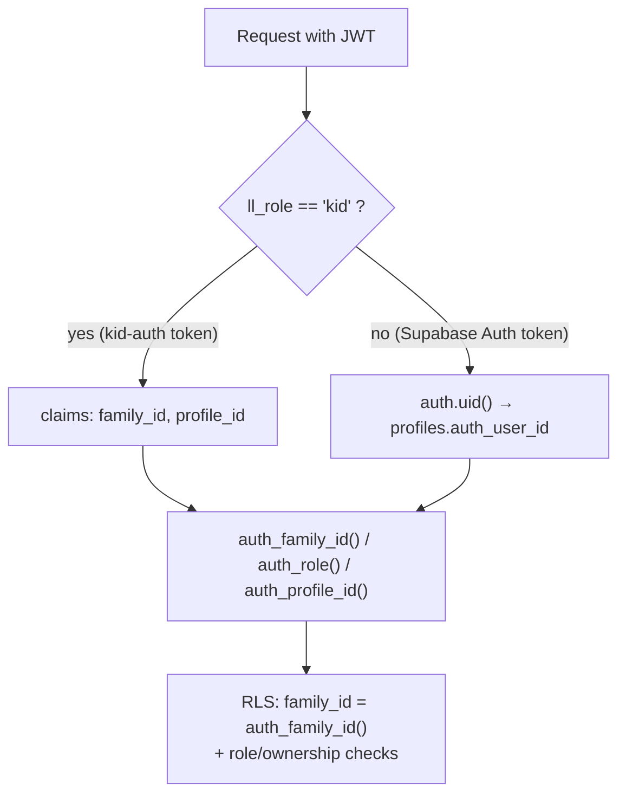

# Security & RLS

Family isolation lives in the **database**, not app code. Two layers enforce it:

1. **Row-Level Security (RLS)** decides which rows a principal can `SELECT` and which non-privileged writes it may make (e.g. a kid claiming a chore, a parent editing the reward catalog).
2. **`SECURITY DEFINER` functions** perform every privileged mutation — anything touching money, balances, or state that must be atomic — while authorizing the caller in-body. See [Atomic Functions](./atomic-functions.md).

Source: `supabase/migrations/002_rls_policies.sql`.

## Principal resolution

There are two kinds of authenticated principal. Helper functions resolve both to `(family_id, role, profile_id)` so every policy is written once.

- **Parents** are real `auth.users` rows. Their JWT is a standard Supabase Auth token carrying **no** custom claims — `auth.uid()` is looked up in `profiles.auth_user_id` to resolve family/role/profile.
- **Kids** are _not_ auth users. The [`kid-auth` Edge Function](./edge-functions.md) verifies the PIN and mints a JWT with custom claims `ll_role='kid'`, `family_id`, `profile_id` (and `role='authenticated'` so PostgREST switches to that DB role). The helpers read these via `auth.jwt()`.

### Helper functions

All are `STABLE SECURITY DEFINER` with a pinned `search_path`, granted to `authenticated` and `anon`:

| Helper              | Returns                                                                                           |
| ------------------- | ------------------------------------------------------------------------------------------------- |
| `auth_is_kid()`     | `true` when the JWT carries `ll_role='kid'`.                                                      |
| `auth_role()`       | `'kid'` from the claim, else `'parent'` resolved from `auth.uid() → profiles`; `NULL` if neither. |
| `auth_profile_id()` | Kid: the `profile_id` claim. Parent: `profiles.id` for the row whose `auth_user_id = auth.uid()`. |
| `auth_family_id()`  | The principal's `family_id` — the keystone of every isolation policy.                             |

A freshly-signed-up parent with no profile yet resolves to `role = NULL` / `family_id = NULL`, which is exactly why family creation must go through the bootstrap [atomic functions](./atomic-functions.md) rather than direct DML.

## Isolation pattern

RLS is enabled on all 16 family-scoped tables, and **every policy requires `family_id = auth_family_id()`** (for `families` itself, `id = auth_family_id()`). On top of that, policies layer role and ownership checks — "kid owns the row" means `kid_id = auth_profile_id()`.

Table-level GRANTs to the `authenticated` role are deliberately coarse; the row-level policies are the real authorization boundary. `anon` gets **nothing** on family data. Read-only tables get SELECT only, so even a policy bug cannot let a client write a balance — the privilege simply isn't granted.

## Per-table read/write boundary

"Client write" means direct table DML under RLS — **not** writes performed by the [atomic functions](./atomic-functions.md), which run as the function owner and bypass RLS.

| Table                  | Read (SELECT)       | Client writes                                                            |
| ---------------------- | ------------------- | ------------------------------------------------------------------------ |
| `families`             | own family          | none (created via bootstrap fn)                                          |
| `profiles`             | whole family        | parent: insert/update/delete; kid: update own row only                   |
| `chores`               | whole family        | parent only (insert/update/delete)                                       |
| `chore_instances`      | whole family        | parent only (also written by the generator edge fn)                      |
| `chore_completions`    | parent all; kid own | kid: insert own, update own while `claimed`/`pending`; parent: update    |
| `wallets`              | parent all; kid own | **none** (SELECT-only grant)                                             |
| `point_transactions`   | parent all; kid own | **none** (SELECT-only grant)                                             |
| `rewards`              | whole family        | parent only (insert/update/delete)                                       |
| `reward_purchases`     | parent all; kid own | parent: update (fulfillment); no INSERT (created by `purchase_reward()`) |
| `reading_logs`         | parent all; kid own | kid: insert own, update own while `pending`; parent: update              |
| `reading_streaks`      | parent all; kid own | **none** (SELECT-only grant)                                             |
| `savings_transactions` | parent all; kid own | **none** (SELECT-only grant)                                             |
| `savings_goals`        | parent all; kid own | kid: insert/update/delete own; parent: insert/update/delete              |
| `schedule_items`       | whole family        | parent only (insert/update/delete)                                       |
| `family_invites`       | parent only         | parent: update/delete; no INSERT (created by `create_family_invite()`)   |

**Read-only tables** — `wallets`, `point_transactions`, `savings_transactions`, `reading_streaks` — have **no client write grant at all**. Their rows are written exclusively by the atomic `SECURITY DEFINER` functions.

## Realtime

The `supabase_realtime` publication includes the family-scoped tables that change live (`wallets`, `point_transactions`, `chore_completions`, `chore_instances`, `reward_purchases`, `reading_logs`, `reading_streaks`, `savings_transactions`, `schedule_items`, `chores`, `rewards`, `profiles`). Realtime **respects RLS**, so each principal only receives change events for rows it may `SELECT` (see `008_realtime.sql`).

See [Atomic Functions](./atomic-functions.md) for the privileged-write layer and [Data Model](./data-model.md) for the table definitions.
