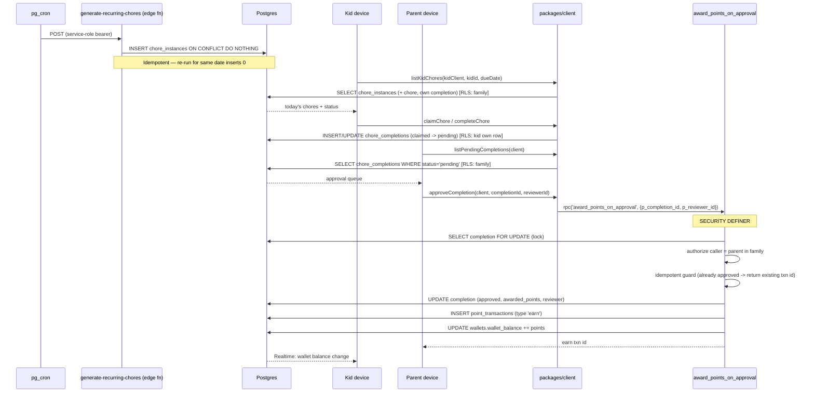

# Chore Approval Flow

This flow traces a single chore across every tier: the `generate-recurring-chores` cron materializes today's `chore_instances`, the kid claims/completes an instance, and a parent approves it — at which point the `award_points_on_approval` atomic function credits the kid's wallet in one transaction. Realtime pushes the new balance back to the kid device.

The kid path uses a kid-session client (`createKidClient`, carrying the minted kid JWT); the parent path uses the parent's GoTrue-authenticated client. Both go through `packages/client` service functions — never raw `supabase` calls.

## Steps

1. **Cron materializes instances.** A scheduler (pg_cron) invokes the `generate-recurring-chores` edge function with the project service-role key. The function opens a direct privileged Postgres connection, loads active chores with a `recurrence_rule`, filters them through the ported `occursOn` (FREQ=DAILY / FREQ=WEEKLY;BYDAY=…), and bulk-inserts `chore_instances` for the target date with `ON CONFLICT (chore_id, due_date) DO NOTHING`. The conflict clause makes re-runs idempotent — a second run for the same date returns `generated: 0`. See `supabase/functions/generate-recurring-chores/index.ts`.

2. **Kid loads today's chores.** The kid device calls `listKidChores(kidClient, kidId, dueDate)` (`packages/client/src/kidChores.ts`). RLS scopes reads to the kid's family; the query embeds the parent chore (title/icon/assignment) and only _this_ kid's completion (filtered server-side by `kid_id`). Chores assigned to another kid are dropped in JS.

3. **Kid claims / completes.** For a shared chore the kid may first `claimChore` (inserts a `chore_completions` row with `status='claimed'`). `completeChore` then transitions the row to `status='pending'` — or inserts a `pending` row directly for the common assigned-chore path. The kid-insert RLS policy requires `kid_id = auth_profile_id()` and the correct `family_id` (read from the instance).

4. **Parent opens the approval queue.** `listPendingCompletions(client)` (`packages/client/src/chores.ts`) selects `chore_completions` where `status='pending'`, embeds the instance (due date, points snapshot) and kid display info, and flattens to `PendingCompletion[]`, oldest first.

5. **Parent approves.** `approveCompletion(client, completionId, reviewerId)` calls `rpc('award_points_on_approval', …)`. Inside the `SECURITY DEFINER` function (`supabase/migrations/003_functions_and_triggers.sql`):
   - The completion row is locked `FOR UPDATE`, serializing concurrent approvals of the same row.
   - The caller is authorized in-body: only a parent (`auth_role() = 'parent'`) in the completion's family may approve. A kid cannot approve, even their own completion.
   - Idempotency: if the completion is already `approved`, the function returns the existing `earn` transaction id without re-awarding. A `rejected` completion raises (must be re-claimed first).
   - Points awarded = the `chore_instances.points` snapshot for that completion.
   - The function sets `status='approved'`, `awarded_points`, `reviewed_by`, `reviewed_at`; inserts a positive `point_transactions` row (`type='earn'`, linked via `chore_completion_id`); and increments `wallets.wallet_balance` — all in one transaction.

6. **Kid sees the new balance.** The kid client subscribes to Realtime with the kid JWT (`createKidClient` calls `client.realtime.setAuth`), so the wallet-balance change from the parent's award is delivered to the kid's subscription under RLS.

## Reject path

`rejectCompletion(client, completionId, reviewerId)` is a plain `UPDATE` (parents may update `chore_completions` directly per RLS) setting `status='rejected'`, `reviewed_by`, `reviewed_at`. No points are awarded and no ledger row is written. A rejected completion cannot later be approved by the RPC — it must be re-claimed.

## See also

- [Chores feature](../features/chores.md)
- [Atomic functions](../backend/atomic-functions.md)
- [Edge functions](../backend/edge-functions.md)
