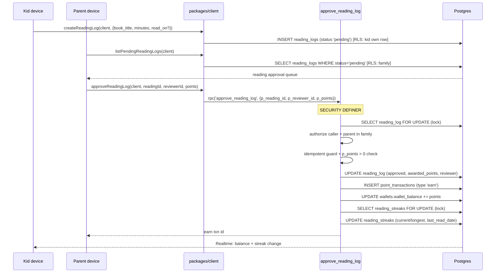

# Reading Streak Flow

This flow traces a reading log from the kid's entry through the parent approval queue to the `approve_reading_log` atomic function — which, in a single transaction, awards points to the wallet _and_ advances the kid's reading streak with gap detection. Points and streak move together, so a re-approval never double-awards or double-bumps.

Both tiers route through `packages/client/src/reading.ts`. `reading_streaks` and the wallet ledger are read-only under RLS; the atomic function is the only writer.

## Steps

1. **Kid logs reading.** `createReadingLog(client, input)` (`packages/client/src/reading.ts`) inserts a `reading_logs` row (`family_id`, `kid_id`, `book_title`, `minutes`, optional `read_on` — defaults to `current_date`) with `status='pending'`. RLS lets a kid insert/edit their own log while it is pending.

2. **Parent opens the reading queue.** `listPendingReadingLogs(client)` selects `reading_logs` where `status='pending'`, embeds the kid display info, and flattens to `PendingReadingLog[]`, oldest first.

3. **Parent approves.** `approveReadingLog(client, readingId, reviewerId, points)` calls `rpc('approve_reading_log', {p_reading_id, p_reviewer_id, p_points})`. Inside the `SECURITY DEFINER` function (`supabase/migrations/007_reading_approval.sql`):
   - The `reading_logs` row is locked `FOR UPDATE`, serializing concurrent approvals of the same log.
   - The caller is authorized in-body: only a parent (`auth_role() = 'parent'`) in the log's family may approve. A kid cannot approve, even their own reading.
   - Idempotency: an already-`approved` log returns the existing `earn` transaction id (no second award, no second streak bump). A `rejected` log raises. `p_points` must be `> 0`.
   - The function sets `status='approved'`, `awarded_points`, `reviewed_by`, `reviewed_at`; inserts a positive `point_transactions` row (`type='earn'`, linked via `reading_log_id`); and increments `wallets.wallet_balance`.
   - It then locks the kid's `reading_streaks` row `FOR UPDATE` and updates the streak (see rules below).

4. **Kid sees the result.** The kid client's Realtime subscription (kid JWT via `createKidClient`) receives the wallet and streak changes under RLS. The current streak is also readable directly via `getReadingStreak(client, kidId)`.

## Streak rules

Evaluated against the streak's `last_read_date`, using the log's `read_on`:

- **Consecutive day** (`last_read_date = read_on - 1`): `current_streak += 1`.
- **Gap** (a new, later `read_on` that is not the next day): `current_streak` resets to `1`.
- **Same day** (`read_on = last_read_date`): no change — that day is already counted.
- **Backdated** (`read_on < last_read_date`): no change — the streak only moves forward on approvals.
- `longest_streak = greatest(longest_streak, current_streak)` on every forward move.

A "missed day" reset is realized lazily at the _next_ approval via the gap branch; a display can also derive staleness directly from `last_read_date` vs today.

## See also

- [Reading feature](../features/reading.md)
- [Atomic functions](../backend/atomic-functions.md)
