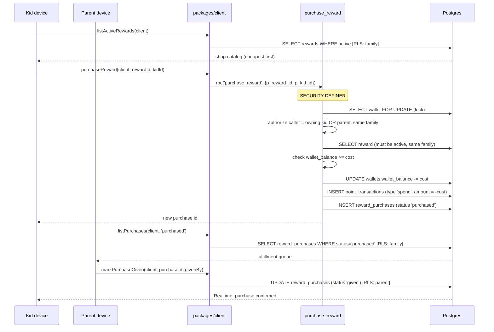

# Reward Purchase Flow

This flow traces a reward from the kid's shop view through the `purchase_reward` atomic function (which debits the wallet, writes the spend ledger row, and records the purchase in one transaction) to the parent's fulfillment queue. The purchase RPC is self-authorizing: it accepts a call from the owning kid _or_ a parent in the same family.

Both tiers route through `packages/client/src/rewards.ts`; neither touches `wallets`, `point_transactions`, or `reward_purchases` directly (those tables are read-only under RLS — the atomic function is the only writer).

## Steps

1. **Kid browses the shop.** `listActiveRewards(client)` (`packages/client/src/rewards.ts`) selects `rewards` where `active = true`, cheapest first. RLS scopes the catalog to the kid's family.

2. **Kid buys.** `purchaseReward(client, rewardId, kidId)` calls `rpc('purchase_reward', {p_reward_id, p_kid_id})`. Inside the `SECURITY DEFINER` function (`supabase/migrations/003_functions_and_triggers.sql`):
   - The kid's `wallets` row is locked `FOR UPDATE` first, serializing concurrent purchases to prevent double-spend.
   - The caller is authorized in-body: they must be in the kid's family _and_ be either that kid (`auth_profile_id() = p_kid_id`) or a parent (`auth_role() = 'parent'`).
   - The reward is loaded and must be `active`, and must belong to the same family as the wallet (defense in depth).
   - If `wallet_balance < cost`, the function raises `insufficient funds` — surfaced to the caller as an error.
   - On success: `wallet_balance -= cost`; a `point_transactions` row is inserted with `type='spend'` and `amount = -cost`; and a `reward_purchases` row is inserted with `status='purchased'`, the cost snapshotted, and a link to the ledger row. All in one transaction.
   - Returns the new `reward_purchases.id`.

3. **Parent opens the fulfillment queue.** `listPurchases(client, 'purchased')` selects `reward_purchases` with the given status (default `'purchased'` = unfulfilled), embeds the reward (title/emoji) and kid display info, and flattens to `FulfillmentItem[]`, newest first.

4. **Parent fulfills.** `markPurchaseGiven(client, purchaseId, givenBy)` is a plain `UPDATE` (parents may update `reward_purchases` per RLS) setting `status='given'`, `given_by`, `given_at`. No balance changes — the points were already debited at purchase time.

5. **Kid sees confirmation.** The kid client's Realtime subscription (authenticated with the kid JWT via `createKidClient`) receives the purchase status change under RLS.

## See also

- [Rewards feature](../features/rewards.md)
- [Atomic functions](../backend/atomic-functions.md)
