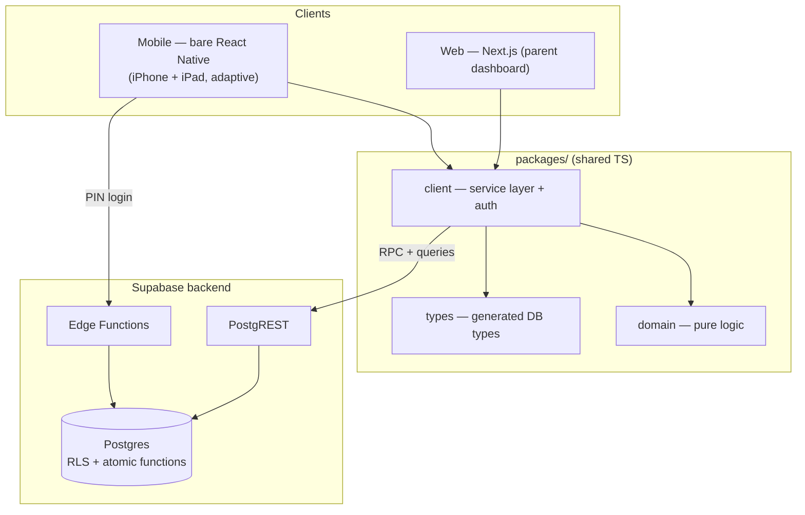

# LootLoop

LootLoop is a family chore & reward app. It has two roles:

- **Parent** — manages chores, rewards, and approvals; runs the family. Uses iPhone, iPad, and the web dashboard (the primary management surface).
- **Kid** — completes chores, earns points, buys rewards, logs reading, and saves. Mobile only (iPhone/iPad); kid-on-web is deferred.

| Role   | iPhone | iPad | Web |
| ------ | :----: | :--: | :-: |
| Parent |   ✅   |  ✅  | ✅  |
| Kid    |   ✅   |  ✅  | ❌  |

## Two ideas that shape everything

Almost every design decision follows from these two rules:

1. **Family isolation is enforced in the database via Row-Level Security (RLS) — never in application code.** Every family-scoped table carries a `family_id`, and every RLS policy keys on `family_id = auth_family_id()`. A screen cannot read or write another family's data even if the client code is wrong. See [security & RLS](./backend/security-rls.md).

2. **All money/state mutations run through atomic SQL functions — never client-side writes.** Awarding points, buying a reward, transferring to savings, crediting interest — each is a single `SECURITY DEFINER` Postgres function that locks the wallet row, authorizes the caller in-body, and commits in one transaction. Balances are read-only to clients. See [atomic functions](./backend/atomic-functions.md).

Because the client calls these functions directly (there is no trusted app server in between), each function **self-authorizes the caller**.

## The system at a glance

A pnpm monorepo with two client apps and shared packages, backed by Supabase (Postgres + RLS + Auth + Edge Functions + Realtime).

See the full [system architecture](./architecture/system.md).

## How this wiki is organized

- **[Getting started](./getting-started/repo-tour.md)** — repo tour and running everything locally.
- **Architecture** — the [system](./architecture/system.md), [stack decisions](./architecture/stack-decisions.md), the [mobile](./architecture/frontend-mobile.md) and [web](./architecture/frontend-web.md) apps, and the [service-layer boundary](./architecture/service-layer.md).
- **Data & backend** — the [data model](./backend/data-model.md), [security & RLS](./backend/security-rls.md), [atomic functions](./backend/atomic-functions.md), [edge functions](./backend/edge-functions.md), and [migrations](./backend/migrations.md).
- **Feature guides** — [chores](./features/chores.md), [rewards](./features/rewards.md), [points & wallet](./features/points-wallet.md), [reading](./features/reading.md), [savings & interest](./features/savings-interest.md), [schedule](./features/schedule.md), and [auth & onboarding](./features/auth-onboarding.md).
- **End-to-end flows** — [chore approval](./flows/chore-approval.md), [reward purchase](./flows/reward-purchase.md), [reading streak](./flows/reading-streak.md), [savings & interest](./flows/savings-interest.md), and [kid provisioning & auth](./flows/kid-provisioning-auth.md).
- **Operations** — [ops runbooks](./operations/ops.md), [CI/CD](./operations/ci-cd.md), and the [roadmap](./operations/roadmap.md).

## Keeping this accurate

This wiki documents the system **as built**. The canonical source of truth for the task breakdown and conventions remains [`lootloop-technical-plan.md`](https://github.com/samipdesai/lootloop/blob/main/lootloop-technical-plan.md) and [`CLAUDE.md`](https://github.com/samipdesai/lootloop/blob/main/CLAUDE.md) in the repo. When code and wiki disagree, the code wins — please fix the page. See [contributing](./contributing.md).
